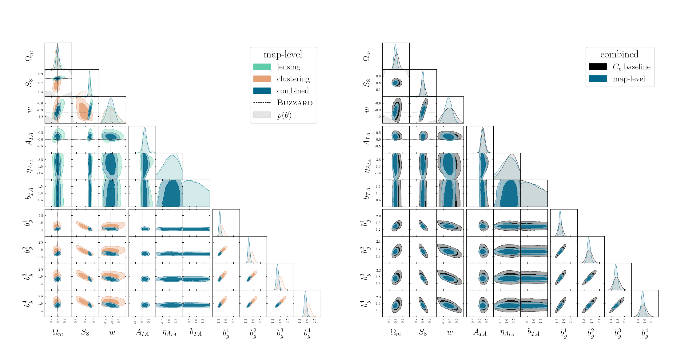

# multiprobe-simulation-inference
[](https://arxiv.org/abs/2511.04681)

Collection of inference methods to go from arbitrary summary statistics (neural network, peaks, power spectrum, ...) to posterior parameter constraints. Inference and neural density estimation methods include:

- **Normalizing Flows:** Conditional implementation from [`FlowConductor`](https://github.com/FabricioArendTorres/FlowConductor)
- **Gaussian Mixture Models:** As a simpler baseline neural density estimator.
- **Gaussian Process Approximate Bayesian Computation:** As an alternative to standard SBI methods [[Fluri et al. 2021](https://arxiv.org/abs/2107.09002)]



## Installation

### Requirements
- Python >= 3.8
- Pre-existing installation of [`PyTorch`](https://pytorch.org/) (required for normalizing flows), [`TensorFlow`](https://www.tensorflow.org/install) and [`TensorFlow-Probability`](https://www.tensorflow.org/probability) (optional, only required for Gaussian Mixture Model components)in the python environment
- [`multiprobe-simulation-forward-model`](https://github.com/des-science/multiprobe-simulation-forward-model) for utilities and data loading
- [`y3-deep-lss`](https://github.com/des-science/y3-deep-lss) for neural network summary statistics preprocessing

### Installation Steps

1. **Install dependencies from GitHub:**
```bash
# Install multiprobe-simulation-forward-model
pip install git+https://github.com/des-science/multiprobe-simulation-forward-model.git

# Install y3-deep-lss
pip install git+https://github.com/des-science/y3-deep-lss.git
```

2. **Install this package in editable mode:**
```bash
pip install -e .
```

## Repository Structure

### `msi`
- `msi/apps` inference scripts for training normalizing flows and running MCMC sampling
- `msi/flow_conductor` normalizing flow implementation using PyTorch and [`enflows`](https://github.com/VincentStimper/normalizing-flows)
- `msi/gaussian_mixture` Gaussian mixture model implementation using TensorFlow Probability
- `msi/utils` utilities for MCMC sampling, preprocessing, diagnostics, and visualization
- `msi/likelihood_base.py` base class for likelihood implementations

### `configs`
Configuration files specifying inference settings and hyperparameters.

### `data`
Stored chains from DES Y3 analyses and figures.

### `notebooks`
Notebooks to perform simulation-based inference via neural likelihood estimation and MCMC sampling. 

## Companion Repositories
- Forward modeling: [`multiprobe-simulation-forward-model`](https://github.com/des-science/multiprobe-simulation-forward-model)
- Informative map-level neural summary statistics: [`y3-deep-lss`](https://github.com/des-science/y3-deep-lss)
