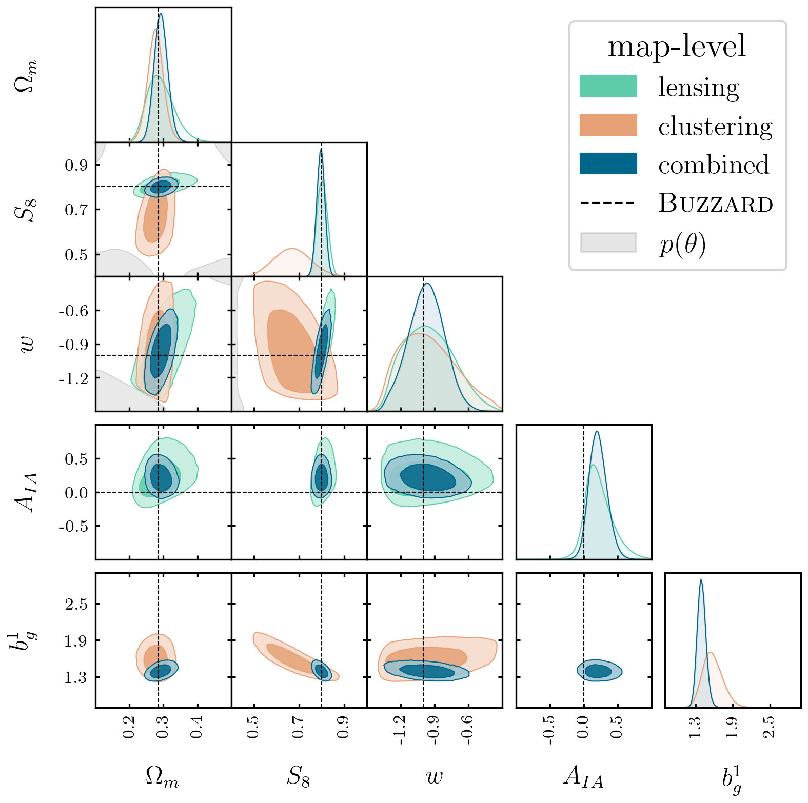

# multiprobe-simulation-inference
[](https://arxiv.org/abs/2511.04681)
[](LICENSE)

Simulation-based inference from arbitrary summary statistics — neural network summaries, peak counts, power spectra — to cosmological posterior constraints [[Thomsen et al. 2026](https://arxiv.org/abs/2511.04681)]. Beyond the posterior itself, the repository provides the diagnostics an SBI analysis has to pass before it can be believed: coverage tests, posterior predictive checks, and quantitative tension between analyses.

- **Normalizing flows:** the production density estimator — conditional flows built on `enflows`, an earlier release of [FlowConductor](https://github.com/FabricioArendTorres/FlowConductor), in PyTorch, trained on the network summaries and sampled with an MCMC sampler.
- **Gaussian mixture models:** a simpler baseline density estimator, in TensorFlow Probability.
- **Diagnostics:** likelihood- and posterior-level coverage (HPD, TARP), posterior predictive checks including the cross-probe consistency test of [[Doux et al. 2021](https://arxiv.org/abs/2011.03410)], and parameter-difference tension estimates.

A Gaussian-process approximate Bayesian computation implementation [[Fluri et al. 2021](https://arxiv.org/abs/2107.09002)] is retained under `msi/deprecated/gp_abc/` but is no longer maintained.



## The analysis pipeline

This repository is the third of three stages:

```
CosmoGridV1 simulations
        |
        v
multiprobe-simulation-forward-model    DES Y3-like WL + GC maps in .tfrecord
        |
        v
y3-deep-lss                            low-dimensional neural summary statistics
        |
        v
multiprobe-simulation-inference        cosmological posterior constraints          <-- this repository
```

[`deepsphere-cosmo-tf2`](https://github.com/deepsphere/deepsphere-cosmo-tf2) supplies the graph convolutional layers on the HEALPix sphere that `y3-deep-lss` builds on.
For a full environment, install in dependency order: `deepsphere-cosmo-tf2` → `multiprobe-simulation-forward-model` → `y3-deep-lss` → `multiprobe-simulation-inference`.

## Installation

Requires Python >= 3.8 and PyTorch for the normalizing flows; TensorFlow >= 2.0 and
TensorFlow-Probability additionally for the Gaussian mixture models and the tension
significance stage.

**Dependencies.** The two companion packages are *not* declared in [`pyproject.toml`](pyproject.toml)
(they are not on PyPI) and must be installed first:

| Package | Why it is needed | Install |
|---|---|---|
| [`multiprobe-simulation-forward-model`](https://github.com/des-science/multiprobe-simulation-forward-model) | Survey configuration, parameter priors, I/O utilities | `pip install git+https://github.com/des-science/multiprobe-simulation-forward-model.git` |
| [`y3-deep-lss`](https://github.com/des-science/y3-deep-lss) | Reads back the configuration of the trained network whose summaries are being used | `pip install git+https://github.com/des-science/y3-deep-lss.git` |

**Install.**

*On clusters where PyTorch is already provided* (recommended — preserves the optimized GPU build):

```bash
pip install -e .[sbi]
```

*Elsewhere:*

```bash
pip install -e .[sbi,torch]
```

*Additionally, for the Gaussian mixture models and the tension significance stage:*

```bash
pip install -e .[sbi,torch,tf]
```

**Extras** declared in [`pyproject.toml`](pyproject.toml):

| Extra | Adds | Needed for |
|---|---|---|
| `sbi` | `sbi`, `enflows` | the normalizing flows — the default inference path |
| `torch` | `torch` | only where PyTorch is not already installed |
| `tf` | `tensorflow>=2.0`, `tensorflow-probability` | Gaussian mixture models, tension significance |
| `dev` | `pytest`, `pytest-cov`, `black`, `flake8`, `ipython`, `jupyter` | development |

## Quickstart

Train a normalizing-flow likelihood on the summaries a `y3-deep-lss` run produced, and sample
the posterior. `--out_dir`/`--model_name` point at that run directory; everything else — which
probes, which parameters, which forward model — is read from the `configs.yaml` the training
run wrote there.

```bash
python msi/apps/run_inference.py \
    --out_dir=/path/to/runs/lensing \
    --model_name=maps \
    --flow_config=configs/flow/maf.yaml \
    --n_flows=4 \
    --include_grid --include_des --include_mocks \
    --sample_posterior
```

`--n_flows=4` trains an ensemble of independently initialized flows instead of a single one.
`--sample_posterior` adds the posterior-level coverage stage: it samples the posterior for the
held-out mock observations in one batched pass and writes `mcmc_samples.h5` for TARP.

The flow config also fixes the **conditioning vector**. `configs/flow/maf.yaml` sets
`extend_params: [ns, Ob, H0]`, so the production flow conditions on those three weakly
constrained parameters rather than marginalizing them implicitly. It has to: CosmoGridV1's grid
is two Sobol sequences, and the narrow half restricts ns, Ob and H0 to roughly an eighth of the
wide half's ranges, which makes the implicit prior discontinuous and the posterior
correspondingly overconfident. Conditioning on them hands the marginalization to the MCMC.
`configs/flow/coverage/ROUND5.md` has the measurement; `configs/flow/maf.yaml` the summary.

## Usage

### Entry points

All in [`msi/apps/`](msi/apps/).

| App | What it does |
|---|---|
| `run_inference.py` | The main driver. Trains a `LikelihoodFlow` (or an ensemble) on the network summaries and samples the posterior by MCMC. Also supports joint two-run setups (`--out_dir_2`), combining summaries across training steps (`--n_steps_multi`, `--n_steps_all`, with optional `--pca_compress`), overriding the config's conditioning vector (`--extend_params`), and reloading a trained flow (`--load_flow`). |
| `run_ppc.py` | Posterior predictive checks, in two families: **auto**, a per-run goodness of fit, and **cross**, the cross-probe consistency test of Doux et al. 2021, evaluated in both directions. Checkpoint-aware — a re-run recovers trained flows from disk. |
| `run_tension_chains.py` | Tension, stage A (PyTorch): builds the parameter-difference chains for each run pair and mock observation, both uncorrelated (independently sampled chains) and correlated (the shared-parameter shift of the joint residual posterior). |
| `run_tension_values.py` | Tension, stage B (TensorFlow): turns those difference chains into an n-sigma significance and writes it out as YAML. |

### The configuration contract

Every app above takes two configs, and the split is the design idea of the repository: *which
runs* to analyse is separated from *how* to analyse them, so a method can be re-applied to a new
set of runs, and a set of runs re-analysed with a new method, without editing either file.

| Kind | Directory | Defines |
|---|---|---|
| Runs | [`configs/runs/`](configs/runs/) | which trained runs to analyse — organized by data representation (maps / Cls) and probe, each entry giving the prediction directory, the training-step count, the parameters, plus the comparisons and observation labels to build |
| Flow | [`configs/flow/`](configs/flow/) | normalizing-flow architecture and training hyperparameters, and the diagnostics settings |
| PPC | [`configs/ppc/`](configs/ppc/) | posterior-predictive-check hyperparameters |
| Tension | [`configs/tension/`](configs/tension/), [`configs/tension_pairs/`](configs/tension_pairs/) | tension method settings, and the run pairs for the direct estimator |

[`configs/config.yaml`](configs/config.yaml) is separate: a registry of the published DES Y3
chains stored under `data/`, keyed by cosmology, intrinsic-alignment model and probe combination.

### Where the inputs come from

`run_inference.py` does not take probe, parameter or forward-model configs directly. It reads
the `configs.yaml` that the `y3-deep-lss` training run wrote into its own run directory —
that file is the record of what the network was trained on, and it is the seam between the two
repositories. `--msfm_config` / `--dlss_config` exist only to override it.

## Repository layout

```
msi/
  apps/               the entry points above (+ deprecated/)
  flow_conductor/     normalizing flows in PyTorch: likelihood_flow.py is the main class,
                      plus architecture.py, maf.py, spline.py, marginal_flow.py
  gaussian_mixture/   the TensorFlow-Probability baseline density estimator
  utils/              coverage (HPD/TARP), ppc, tensions, mcmc, chains, dataset,
                      preprocessing, observations, diagnostics, plotting, ...
  likelihood_base.py  base class both density-estimator backends extend
  deprecated/         superseded implementations, incl. gp_abc/
configs/              runs/ (which runs) and flow/, ppc/, tension/, tension_pairs/ (how)
data/                 published DES Y3 chains and figures
submissions/          SLURM scripts, parameterized by environment variable
notebooks/            end-to-end inference walk-throughs for maps, Cls and 2pt summaries
dev/                  exploratory notebooks, scripts and notes; not part of the release path
```

### `submissions`

SLURM scripts for a multi-GPU cluster: `ppc.sh`, `tension.sh` (which runs both tension stages
back to back, switching environments between them) and `fisher_cls.sh`. There is no inference
submission script here — the inference stage is launched from the `y3-deep-lss` side, as the
tail of its training job. These scripts are written against one specific cluster and are
included as a worked example, not as a portable script set.

## Conventions

- **Two environments, by design.** The flows, the posterior predictive checks and tension
  stage A run in PyTorch; the Gaussian mixture models and the tension significance in stage B
  run in TensorFlow. Any pipeline that spans both has to switch environments in between —
  `submissions/tension.sh` shows how.
- **`independent_cross=False` is the paper-faithful cross-probe PPC mode.** It reproduces the
  Doux et al. 2021 construction; the independent variant is a diagnostic, not the published test.
- **The correlated tension estimator assumes identical realizations.** Stage A asserts it, which
  is why it refuses cross-setup pairs. Different simulation setups require a separately
  justified comparison; matching index labels alone does not establish matching skies.
- **Flow training is checkpointed.** Re-running an app recovers trained flows from disk rather
  than retraining; pass `--retrain_flows` (PPC) or omit `--load_flow` on a fresh directory to
  force new training.
- **The conditioning vector belongs to the flow config, not the command line.** `extend_params`
  is a property of the density being estimated, so it lives beside the architecture and is
  recorded in the run directory. `--extend_params` overrides it for one invocation and then
  defaults `--flow_label` to `ext`, so an experiment cannot overwrite the checkpoint it is
  being compared against.
- **Write scientific-notation floats with an explicit decimal point.** In YAML, a bare `1e-3`
  parses as a *string*; `1.0e-3` parses as a float. The string silently propagates.

## Troubleshooting

| Symptom | Cause and fix |
|---|---|
| `run_inference.py` cannot find `configs.yaml` | `--out_dir`/`--model_name` do not point at a completed `y3-deep-lss` run directory. The training run writes that file; without it there is no record of what the summaries mean. |
| Re-running produces the same flow instantly | Working as intended — the checkpoint was reloaded. Use `--retrain_flows` (PPC) or a fresh `--flow_label` to train a new one. |
| Tension stage A asserts on mismatched realizations | The two runs were not analysed on the same simulations, so the correlated estimator does not apply. Use runs evaluated on the same simulations for the correlated estimator. |
| `--sample_posterior` warns and skips | It requires `--mcmc_backend=torch_batched` (the default); the `emcee` backend does not support the batched coverage pass. |
| A hyperparameter behaves as if unset, with no error | A bare `1e-3` in the config YAML parsed as a string. Write `1.0e-3`. |

## Companion repositories

| Repository | Package | Role |
|---|---|---|
| [`multiprobe-simulation-forward-model`](https://github.com/des-science/multiprobe-simulation-forward-model) | `msfm` | Forward-models DES Y3-like weak lensing and galaxy clustering maps from CosmoGridV1 |
| [`y3-deep-lss`](https://github.com/des-science/y3-deep-lss) | `deep_lss` | Trains networks that compress those maps into informative summary statistics |
| **`multiprobe-simulation-inference`** (this repository) | `msi` | Turns summary statistics into cosmological posterior constraints |
| [`deepsphere-cosmo-tf2`](https://github.com/deepsphere/deepsphere-cosmo-tf2) | `deepsphere` | Graph convolutional layers on the HEALPix sphere, used by `y3-deep-lss` |

## License and citation

Released under the terms of the [MIT license](LICENSE).

If you use this code, please cite:

```bibtex
@misc{thomsen2026darkenergysurveyyear,
      title={Dark Energy Survey Year 3 results: Simulation-based $w$CDM inference from weak lensing and galaxy clustering maps with deep learning: Analysis design},
      author={A. Thomsen and J. Bucko and T. Kacprzak and V. Ajani and J. Fluri and A. Refregier and D. Anbajagane and F. J. Castander and A. Ferté and M. Gatti and N. Jeffrey and A. Alarcon and A. Amon and K. Bechtol and M. R. Becker and G. M. Bernstein and A. Campos and A. Carnero Rosell and C. Chang and R. Chen and A. Choi and M. Crocce and C. Davis and J. DeRose and S. Dodelson and C. Doux and K. Eckert and J. Elvin-Poole and S. Everett and P. Fosalba and D. Gruen and I. Harrison and K. Herner and E. M. Huff and M. Jarvis and N. Kuropatkin and P. -F. Leget and N. MacCrann and J. McCullough and J. Myles and A. Navarro-Alsina and S. Pandey and A. Porredon and J. Prat and M. Raveri and M. Rodriguez-Monroy and R. P. Rollins and A. Roodman and E. S. Rykoff and C. Sánchez and L. F. Secco and E. Sheldon and T. Shin and M. A. Troxel and I. Tutusaus and T. N. Varga and N. Weaverdyck and R. H. Wechsler and B. Yanny and B. Yin and Y. Zhang and J. Zuntz and M. Aguena and S. Allam and F. Andrade-Oliveira and D. Bacon and J. Blazek and D. Brooks and R. Camilleri and J. Carretero and R. Cawthon and L. N. da Costa and M. E. da Silva Pereira and T. M. Davis and J. De Vicente and S. Desai and P. Doel and J. García-Bellido and G. Gutierrez and S. R. Hinton and D. L. Hollowood and K. Honscheid and D. J. James and K. Kuehn and O. Lahav and S. Lee and J. L. Marshall and J. Mena-Fernández and F. Menanteau and R. Miquel and J. Muir and R. L. C. Ogando and A. A. Plazas Malagón and E. Sanchez and D. Sanchez Cid and I. Sevilla-Noarbe and M. Smith and E. Suchyta and M. E. C. Swanson and D. Thomas and C. To and D. L. Tucker},
      year={2026},
      eprint={2511.04681},
      archivePrefix={arXiv},
      primaryClass={astro-ph.CO},
      doi={https://doi.org/10.1103/3sj1-1l9f},
      url={https://arxiv.org/abs/2511.04681},
}
```

Please also cite [Doux et al. 2021](https://arxiv.org/abs/2011.03410) if you use the cross-probe posterior predictive check.
